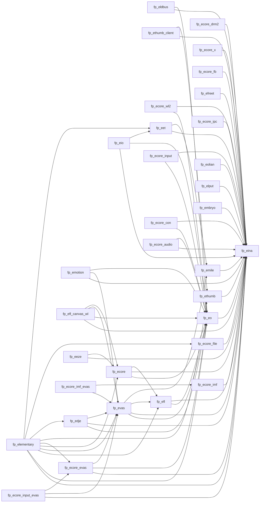

```mermaid
flowchart LR
    fp_eo --> fp_eina
    fp_eldbus --> fp_eina
    fp_eldbus --> fp_eo
    fp_ecore_drm2 --> fp_eina
    fp_ethumb_client --> fp_eina
    fp_ethumb_client --> fp_ethumb
    fp_ecore_wl2 --> fp_eo
    fp_ecore_wl2 --> fp_eina
    fp_ecore_x --> fp_eina
    fp_ecore_input_evas --> fp_eina
    fp_ecore_input_evas --> fp_evas
    fp_ecore_input_evas --> fp_ecore_evas
    fp_efl --> fp_eo
    fp_efl --> fp_eina
    fp_ecore_fb --> fp_eina
    fp_efreet --> fp_eina
    fp_evas --> fp_eo
    fp_evas --> fp_eina
    fp_evas --> fp_efl
    fp_evas --> fp_emile
    fp_eio --> fp_eina
    fp_eio --> fp_eo
    fp_eio --> fp_eet
    fp_ecore_evas --> fp_eina
    fp_ecore_evas --> fp_eo
    fp_ecore_evas --> fp_evas
    fp_eet --> fp_eina
    fp_eet --> fp_emile
    fp_ecore_ipc --> fp_eina
    fp_emile --> fp_eina
    fp_ecore_file --> fp_eina
    fp_ecore_input --> fp_eo
    fp_ecore_input --> fp_eina
    fp_ecore_imf --> fp_eina
    fp_emotion --> fp_eina
    fp_emotion --> fp_evas
    fp_emotion --> fp_eo
    fp_eolian --> fp_eina
    fp_ecore_con --> fp_eo
    fp_ecore_con --> fp_eina
    fp_efl_canvas_wl --> fp_eina
    fp_efl_canvas_wl --> fp_eo
    fp_efl_canvas_wl --> fp_evas
    fp_efl_canvas_wl --> fp_ecore
    fp_ethumb --> fp_eina
    fp_elementary --> fp_eina
    fp_elementary --> fp_eo
    fp_elementary --> fp_efl
    fp_elementary --> fp_evas
    fp_elementary --> fp_ecore
    fp_elementary --> fp_ecore_evas
    fp_elementary --> fp_ethumb
    fp_elementary --> fp_edje
    fp_elementary --> fp_ecore_file
    fp_elementary --> fp_eet
    fp_edje --> fp_eo
    fp_edje --> fp_eina
    fp_edje --> fp_evas
    fp_eeze --> fp_eina
    fp_eeze --> fp_ecore
    fp_ecore_imf_evas --> fp_evas
    fp_ecore_imf_evas --> fp_ecore_imf
    fp_elput --> fp_eina
    fp_ecore_audio --> fp_eina
    fp_ecore_audio --> fp_eo
    fp_ecore --> fp_eo
    fp_ecore --> fp_eina
    fp_ecore --> fp_efl
    fp_embryo --> fp_eina
```

