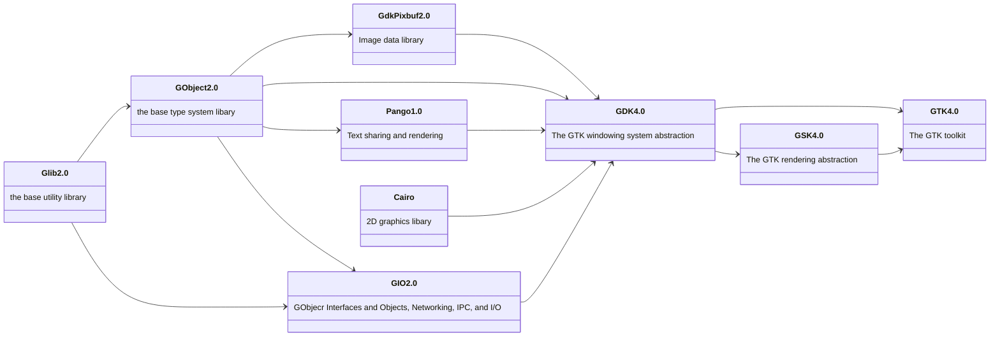

# Inhalt
| **Paket Name:**   | **Version:** | **Beschrieb:**                             | **Download:**                                                  |
| ---               | ---          | ---                                        | ---                                                            |
| **glib2**         | 2.80.0       | GIMP Library                               | https://gitlab.gnome.org/GNOME/glib                            |
| **gio-unix-2.0**  | 2.80.0       | Unix input/output                          | gehört zu glib2                                                |
| **Cairo**         | 1.18.1       | 2D Grafik Bibliothek                       | https://gitlab.freedesktop.org/cairo/cairo                     |
| **FreeType2**     | 2.13.2       | Schriftartenrasterung                      | https://gitlab.freedesktop.org/freetype/freetype               |
| **graphene**      | 1.10.8       | Graphen (Bibliothek grafischer Datentypen) | https://github.com/ebassi/graphene                             |
| **harfbuzz**      | 8.3.0        | Softwarebibliothek für Text-Shaping        | https://github.com/harfbuzz/harfbuzz                           |
| **Pango**         | 1.52.1       | Text Layout                                | https://gitlab.gnome.org/GNOME/pango                           |
| **GdkPixbuf2**    | 2.42.10      | Bildpuffer für GTKx                        | https://gitlab.gnome.org/GNOME/gdk-pixbuf                      |
| **GTK4**          | 4.14.2       | GIMP Toolkit                               | https://gitlab.gnome.org/GNOME/gtk                             |
|                   |              |                                            |                                                                |
| **WebKitGTK6**    | 2.46.4       | GTK4 Web-Browser                           | https://github.com/WebKit                                      |
| **gstreamer**     | 1.24.2.0     | GStreamer Multimedia Framework             | https://gitlab.freedesktop.org/gstreamer                       |
| **gstreamer ges** | 1.24.2.0     | GStreamer Editing Services                 | https://gitlab.freedesktop.org/gstreamer/gst-editing-services  |
|                   |              |                                            |                                                                |
| **chafa**         | 1.14.0       | Console Grafik Ausgabe                     | https://github.com/hpjansson/chafa                             |


## Pakete installieren
- `sudo apt install libgstreamer-plugins-bad1.0-dev`
- `sudo apt install libgstreamer-plugins-base1.0-dev`
- `sudo apt install libges-1.0-dev` 


## Paketinfo
Installierte Version der C-Libs abfragen:
- glib `pkg-config --modversion glib-2.0` 
- cairo `pkg-config --modversion cairo` 
- graphene `pkg-config --modversion graphene-1.0`
- harfbuzz `pkg-config --modversion harfbuzz`
- pango `pkg-config --modversion pango` 
- gdk-pixbuf `pkg-config --modversion gdk-pixbuf-2.0` 
- gtk4 `pkg-config --modversion gtk4` 
- gstreamer `pkg-config --modversion gstreamer-1.0` 

# Hierachie



https://docs.github.com/de/get-started/writing-on-github/working-with-advanced-formatting/creating-diagrams#creating-mermaid-diagrams


# Wichtiger Hinweis
Da in den glib-Funktionen ein `invalid floating point operation` ausgelöst werden kann braucht ee folgendes:
```pascal
uses
  math;
begin
  SetExceptionMask([exInvalidOp, exDenormalized, exZeroDivide, exOverflow, exUnderflow, exPrecision]);
  GTK_blabla;
end.
```
Da dies in der glib2-packages schon gemacht wird, kann man auf dies bei Verwendung der Packages in eigenen Programmen verzichten.

## HarfBuzz

### Font auf dem Terminal angucken
`sudo apt install libharfbuzz-bin`
hb-view Ubuntu-B.ttf "Hello"


## GLIB2 
https://github.com/wadester/wh_test_glib/blob/master/glib_test1.c

## gobject
https://github.com/ToshioCP/Gobject-tutorial?tab=readme-ov-file

## GTK4
https://github.com/ToshioCP/Gtk4-tutorial

## gstreamer

### Tools
Plugin-Infos:
- `gst-inspect-1.0 --plugin`
- `gst-inspect-1.0 --plugin alsa`

### Pakete
`sudo apt install libva-dev`

### C-Examples
- https://gstreamer.freedesktop.org/documentation/tutorials/basic/hello-world.html?gi-language=c
- https://github.com/GStreamer/gst-plugins-good/blob/master/tests/check/elements/id3demux.c

### wine PATH
Folgende Datei editieren:
- `~/.bashrc`
Folgendes an Ende einfügen:
- `export WINEPATH="$WINEPATH;C:\users\tux\mingw64\bin;C:\gstreamer\1.0\msvc_x86_64\bin"`
Aktualisieren:
- `source ~/.bashrc`

### mp3 Tag Tools
- id3v2
- mp3tag
- kid3

### Vorgeekte pakete

/usr/include/webkitgtk-6.0
/usr/include/libadwaita-1
/usr/include/gstreamer-1.0/ges
/usr/include/sysprof-6

### GTK Inspector

`sudo apt-get install dconf-editor`

Strg + Shift + I: Öffnet den GTK Inspector.
Strg + Shift + D: Öffnet den Inspector und wählt automatisch das Widget unter dem Mauszeiger aus.

#### GTK-Builder

`sudo apt install gnome-builder`


https://www.perplexity.ai/search/wie-installiert-man-den-gtk-in-3L9fGIGmTL.WqgEg.TOEQw

# Schlagwörter
fpc lazarus delphi pascal GTK GTK4 GLIB GLIB2 gestreamer cairo pango adwaita harfbuzz freetype webkit


