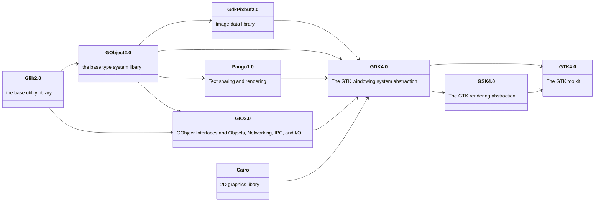

# Inhalt

Diese Package Sammlung stellt **FPC/Lazarus Bindungen** für folgende Pakete zu Verfügung:

| **Paket Name:**     | **Version:**     | **Beschrieb:**                             | **GLIB2** | **GTK4** | **Download:**                                                  |
| ---                 | ---              | ---                                        | ---       | ---      | ---                                                            |
| **libxml2**         | 2.9.14           | Bearbeiten von XML-Dateien                 |  ❌       | ❌       | https://gitlab.gnome.org/GNOME/libxml2                         |
| **FreeType2**       | 2.13.2           | Schriftartenrasterung                      |  ❌       | ❌       | https://gitlab.freedesktop.org/freetype/freetype               |
| **harfbuzz**        | 8.3.0            | Softwarebibliothek für Text-Shaping        |  ❌       | ❌       | https://github.com/harfbuzz/harfbuzz                           |
| **graphene**        | 1.10.8           | Graphen (Bibliothek grafischer Datentypen) |  ❌       | ❌       | https://github.com/ebassi/graphene                             |
| **Cairo**           | 1.18.1           | 2D Grafik Bibliothek                       |  ❌       | ❌       | https://gitlab.freedesktop.org/cairo/cairo                     |
| **glib2**           | 2.80.0           | GIMP Library                               |  ❌       | ❌       | https://gitlab.gnome.org/GNOME/glib                            |
| **gio-unix-2.0**    | 2.80.0           | Unix input/output                          |  ❌       | ❌       | gehört zu glib2                                                |
| **Pango**           | 1.52.1           | Text Layout                                |  ✅       | ❌       | https://gitlab.gnome.org/GNOME/pango                           |
| **GdkPixbuf2**      | 2.42.10          | Bildpuffer für GTKx                        |  ✅       | ✅       | https://gitlab.gnome.org/GNOME/gdk-pixbuf                      |
| **GdkPixbuf_xlib2** | 2.40.2           | Bildpuffer für XLIB (veraltet)             |  ✅       | ❌       | https://gitlab.gnome.org/Archive/gdk-pixbuf-xlib               |
| **GTK4**            | 4.14.2           | GIMP Toolkit                               |  ✅       | ✅       | https://gitlab.gnome.org/GNOME/gtk                             |
| **GSK4**            | 4.14.2           | GTK Scene Kit)                             |  ✅       | ✅       | gehört zu gtk4                                                 |
| **GDK4**            | 4.14.2           | GIMP Drawing Kit                           |  ✅       | ✅       | gehört zu gtk4                                                 |
|                     |                  |                                            |           |          |                                                                |
| **WebKitGTK6**      | 2.46.4           | GTK4 Web-Browser                           |  ✅       | ✅       | https://github.com/WebKit                                      |
| **VTE-2.91-gtk4**   | 2.46.4           | Virtueles Terminal für GTK4                |  ✅       | ✅       | https://gitlab.gnome.org/GNOME/vte                             |
| **GTKSourceView**   | 5.12.0           | GTK4 Source Viewer                         |  ✅       | ✅       | https://gitlab.gnome.org/GNOME/gtksourceview                   |
| **gstreamer**       | 1.24.2.0         | GStreamer Multimedia Framework             |  ✅       | ✅       | https://gitlab.freedesktop.org/gstreamer                       |
| **gstreamer ges**   | 1.24.2.0         | GStreamer Editing Services                 |  ✅       | ✅       | https://gitlab.freedesktop.org/gstreamer/gst-editing-services  |
|                     |                  |                                            |           |          |                                                                |
| **chafa**           | 1.14.0           | Console Grafik Ausgabe                     |  ✅       | ❌       | https://github.com/hpjansson/chafa                             |
| **microhttpd**      | 1.0.0            | HTTP-Server-Bibliothek                     |  ❌       | ❌       | https://github.com/Karlson2k/libmicrohttpd                     |
| **tommath**         | 1.2.1/1.3.0 📌   | Rechnen mit übewrgrossen Ganz-Zahlen       |  ❌       | ❌       | https://github.com/hpjansson/chafa                             |
| **gmp**             | 6.3.0            | Rechnen mit übewrgrossen Zahlen            |  ❌       | ❌       | https://gmplib.org/                                            |
| **tcl/tk**          | 1.14.0           | Tool Command Language                      |  ❌       | ❌       | https://github.com/hpjansson/chafa                             |
| **newt**            | 0.52.24          | A library for text mode user interfaces    |  ❌       | ❌       | https://pagure.io/newt/commits/master                          |
| **tickit**          | 0.4.3            | Terminal Interface Construction Kit        |  ❌       | ❌       | https://github.com/leonerd/libtickit                           |

**📌** 1.2.1 ist bei Mint dabei, hat aber Fehler bei SizeInt.


## Pakete installieren
`sudo apt install libxml2-dev libfreetype6-dev libharfbuzz-dev libgraphene-1.0-dev libcairo2-dev libglib2.0-dev libpango1.0-dev libgdk-pixbuf2.0-dev libgtk-4-dev libwebkit2gtk-6.0-dev libgtksourceview-5-dev gstreamer1.0-tools gstreamer1.0-plugins-base gstreamer1.0-plugins-good gstreamer1.0-plugins-bad gstreamer1.0-plugins-ugly gstreamer1.0-libav libges-1.0-dev libchafa-dev libmicrohttpd-dev`


## Paketinfo
Siehe:
`lib-version.sh`

# Hierachie


https://docs.github.com/de/get-started/writing-on-github/working-with-advanced-formatting/creating-diagrams#creating-mermaid-diagrams


# Wichtiger Hinweis
Da in den glib-Funktionen ein `invalid floating point operation` ausgelöst werden kann braucht ee folgendes:
```pascal
uses
  math;
begin
  SetExceptionMask([exInvalidOp, exDenormalized, exZeroDivide, exOverflow, exUnderflow, exPrecision]);
  GTK_blabla;
end.
```
Da dies in der glib2-packages schon gemacht wird, kann man auf dies bei Verwendung der Packages in eigenen Programmen verzichten.

## HarfBuzz

### Font auf dem Terminal angucken
`sudo apt install libharfbuzz-bin`
hb-view Ubuntu-B.ttf "Hello"


## GLIB2 
https://github.com/wadester/wh_test_glib/blob/master/glib_test1.c

## gobject
https://github.com/ToshioCP/Gobject-tutorial?tab=readme-ov-file

## GTK4
https://github.com/ToshioCP/Gtk4-tutorial

## gstreamer

### Tools
Plugin-Infos:
- `gst-inspect-1.0 --plugin`
- `gst-inspect-1.0 --plugin alsa`

### Pakete
`sudo apt install libva-dev`

### C-Examples
- https://gstreamer.freedesktop.org/documentation/tutorials/basic/hello-world.html?gi-language=c
- https://github.com/GStreamer/gst-plugins-good/blob/master/tests/check/elements/id3demux.c

### wine PATH
Folgende Datei editieren:
- `~/.bashrc`
Folgendes an Ende einfügen:
- `export WINEPATH="$WINEPATH;C:\users\tux\mingw64\bin;C:\gstreamer\1.0\msvc_x86_64\bin"`
Aktualisieren:
- `source ~/.bashrc`

### mp3 Tag Tools
- id3v2
- mp3tag
- kid3

### Vorgemerkte pakete

/usr/include/sysprof-6
slang

### GTK Inspector

`sudo apt-get install dconf-editor`

Strg + Shift + I: Öffnet den GTK Inspector.
Strg + Shift + D: Öffnet den Inspector und wählt automatisch das Widget unter dem Mauszeiger aus.

#### GTK-Builder

`sudo apt install gnome-builder`

https://www.perplexity.ai/search/wie-installiert-man-den-gtk-in-3L9fGIGmTL.WqgEg.TOEQw


## Extensionen
Hat *.vala Dateien 
`git clone https://github.com/lcallarec/live-chart.git`


Ist veraltet
`git clone https://github.com/lundmar/gtkchart.git`


# Quellen für DLLs
- https://repo.msys2.org/mingw/mingw64/

# Schlagwörter
fpc lazarus delphi pascal GTK GTK4 GLIB GLIB2 gestreamer cairo pango adwaita harfbuzz freetype webkit


